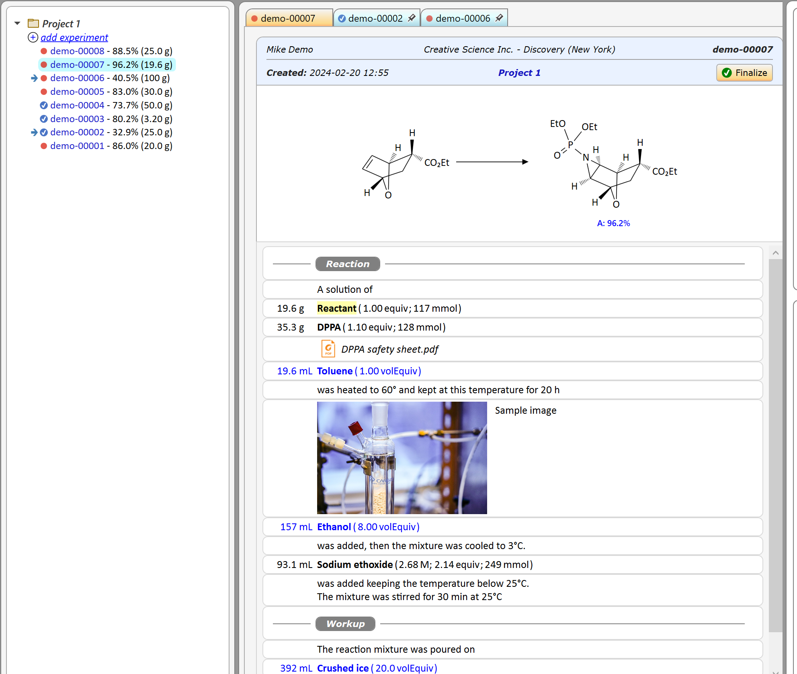

# Phoenix ELN

*Phoenix ELN* is an electronic lab notebook supporting organic, organometallic, peptide, resin and polymer chemistry. 

 

## The Experiment Protocol

- Embed reactants, reagents, solvents, auxiliaries, comments, products, images and files in the sequence of your workflow.
- Protocol materials are supplied with stoichiometric data (equivalents & mmols) when added to the protocol.
- Reference reactant and product obtain their molecular weights directly from the reaction sketch.
- A self learning materials database (see below) allows for the fluent entry of reagents, solvents and auxiliaries. There's need no to look up properties like molecular weights and/or densities once you have entered a material for the first time.
- Rearrange all protocol elements via drag & drop.
- Insert or append elements.
- Switch between lab view (weights/volumes first) and design view (equivalents first).
- Export the protocol content to PDF (compliant with PDF/A-3b archival format), or print it. Documents inserted into the protocol are embedded as PDF attachments.

## Materials Database

*Phoenix ELN* comes with a built-in collection of around 200 commonly used materials (reagents, solvents and auxiliaries) containing cross-checked molecular weights and densities. Own, additional materials and their properties are remembered as you enter them into the experiment protocol and will be available the next time you need them.

## Chemical Drawing Editor

*Phoenix ELN* features an integrated chemical reaction drawing editor:
- Supports organic, salt, multi-component, organometallic, peptide, resin and polymer structures.
- Concise in-place context menus and intelligent next bond proposals prevent constant round-trips to application toolbars while drawing, resulting in a fluent drawing process.
- The reaction sketch is rendered as high resolution vector graphics.
- See the [documentation](https://chembytes.com/helpdocs/ChemBytesDraw-2/DrawBonds.html) (-> ChemBytes) for more information

## Synthesis Metadata

*Phoenix ELN* summarizes all experiments containing the same chemical reaction (same reference reactant and product) as the current experiment in an auto-generated list, sortable by experiment yield and scale. This provides a valuable overview on the current state of work, especially during optimizations.

## ELN Server Integration (optional)

*Phoenix ELN* runs fully self-sustained without any server connection. However, if you wish to take advantage of in-house server synchronization of your data for continuous backup and experiment sharing across your organization, you may consider to install the *[Phoenix ELN Server Package](https://github.com/abrechts/Phoenix-ELN-Server-Package)*. This package contains an installation script for the required MySQL or MariaDB server database, along with detailed instructions, also covering inexpensive NAS systems. 

